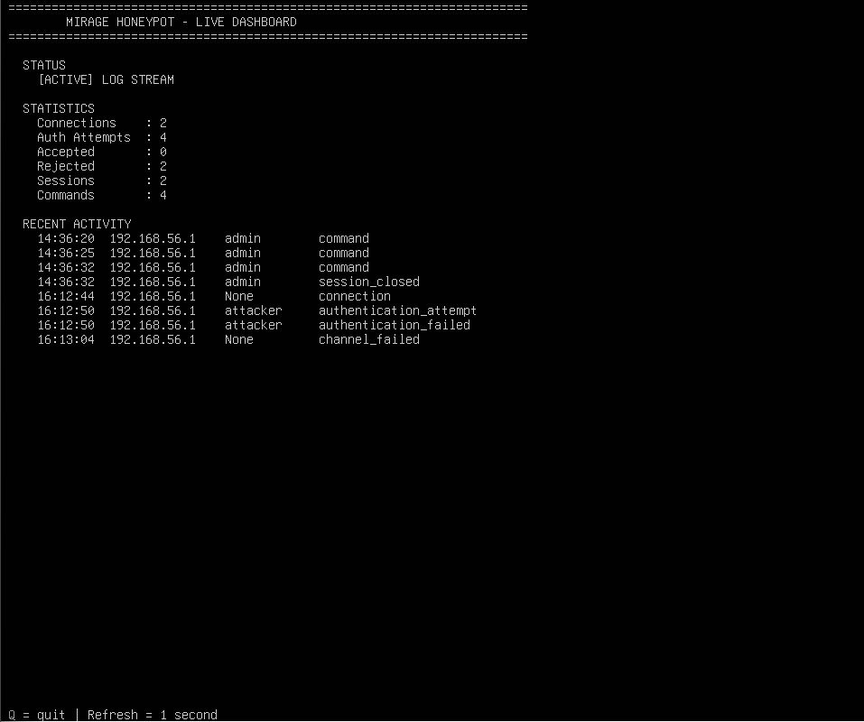
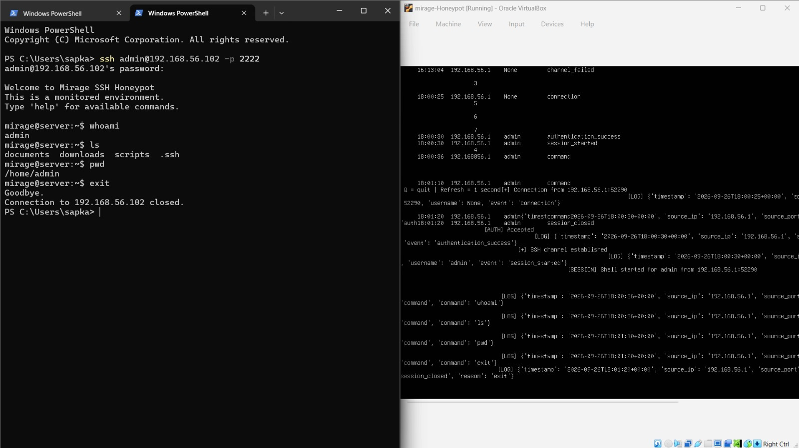

# Mirage SSH Honeypot

A locally isolated SSH honeypot built with Python and Paramiko to simulate an SSH service, capture authentication activity, record attacker commands, and provide a live terminal dashboard for monitoring.

> **Purpose:** Defensive security research, protocol understanding, logging, and hands-on detection engineering.

## Overview

Mirage simulates an SSH server on a dedicated Ubuntu VM. It accepts controlled authentication attempts and presents a fake interactive shell without executing attacker commands on the underlying operating system.

The project is designed to help study:

- SSH authentication behavior
- Brute-force and failed-login patterns
- Session activity
- Command logging
- Structured security events
- Real-time monitoring

## Architecture

```text
                         Host-Only Network
                         192.168.56.0/24

┌──────────────────────┐                    ┌──────────────────────────┐
│   Windows Host       │                    │   Mirage Honeypot VM     │
│   192.168.56.1       │ ─── SSH :2222 ──► │   192.168.56.102         │
│                      │                    │                          │
│  SSH client / demo   │                    │  Paramiko SSH server     │
└──────────────────────┘                    │  Fake authentication     │
                                            │  Fake interactive shell  │
                                            │  JSONL event logging     │
                                            │  Live dashboard           │
                                            └──────────────────────────┘
```

The honeypot is intentionally operated on a **Host-Only network** and is not intended to be exposed directly to the public Internet.

## Features

### SSH Honeypot
- SSH protocol handling using Paramiko
- Dedicated Ed25519 host key
- Controlled password authentication
- Fake interactive shell
- Input buffering and basic backspace handling
- Simulated commands such as:
  - `help`
  - `whoami`
  - `pwd`
  - `ls`
  - `id`
  - `uname -a`
  - `exit`
- Unknown commands return simulated shell errors
- Commands are logged instead of executed on the host

### Structured Event Logging

Events are written to:

```text
logs/events.jsonl
```

Example event types include:

```text
connection
authentication_attempt
authentication_success
authentication_failed
session_started
command
session_closed
```

Each event contains structured information such as timestamp, source address, username, event type, and command/session data where applicable.

### Live Monitoring Dashboard

`dashboard.py` provides a terminal-based live dashboard showing:

- Connections
- Authentication attempts
- Accepted authentications
- Rejected authentications
- Sessions
- Commands
- Recent activity

The dashboard refreshes automatically while the honeypot is running.

## Project Structure

```text
mirage-ssh-honeypot/
├── ssh_honeypot.py       # Main Paramiko honeypot
├── dashboard.py          # Live terminal dashboard
├── start_mirage.sh       # One-command launcher
├── .env.example          # Example local configuration
├── .gitignore             # Prevents secrets/logs/keys from being committed
├── dashboard.png         # Live dashboard screenshot
└── demo-session.jpg      # SSH session demonstration
```

## Setup

### 1. Clone the repository

```bash
git clone https://github.com/RohanS0304/mirage-ssh-honeypot.git
cd mirage-ssh-honeypot
```

### 2. Install the dependency

```bash
python3 -m pip install paramiko
```

### 3. Create a local environment file

Create `.env`:

```bash
MIRAGE_HONEYPOT_PASSWORD=change-me
```

The `.env` file is intentionally excluded from Git.

### 4. Start Mirage

```bash
chmod +x start_mirage.sh
./start_mirage.sh
```

The launcher starts the honeypot and dashboard together.

## Demonstration

The honeypot can be tested from another machine on the same isolated Host-Only network:

```bash
ssh admin@192.168.56.102 -p 2222
```

After authentication, commands entered into the fake shell are recorded as honeypot events.

### Live Dashboard



### SSH Session + Monitoring



## Security Design

Mirage is intentionally separated from the main Mirage Lab server.

Important safeguards:

- Honeypot runs in a separate VM.
- Operation is restricted to a Host-Only network.
- Commands typed into the fake shell are **not executed** by the operating system.
- Credentials are stored locally through `.env`.
- Host keys and logs are excluded from version control.
- The project should not be exposed to the public Internet without additional isolation and hardening.

## What I Learned

This project provided hands-on experience with:

- SSH protocol and authentication flow
- Paramiko and Python network programming
- TCP service behavior
- Linux logging and process management
- Structured security event design
- Real-time terminal monitoring
- Git/GitHub project hygiene
- Defensive isolation of security tooling

## Future Improvements

Potential extensions include:

- IP-based attack statistics
- Command frequency analysis
- Session replay
- Geolocation/ASN enrichment for external deployments
- Detection rules for brute-force behavior
- Exporting events to a SIEM
- Alerting and notification support
- Additional simulated services

## Disclaimer

Mirage SSH Honeypot is an educational and defensive security research project intended for controlled environments. Do not deploy it on networks or systems without authorization.
